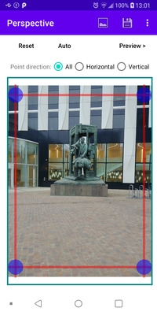
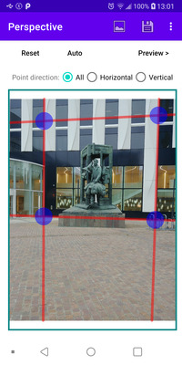
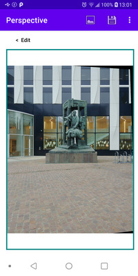

# Perspective #

Android application to fix perspective in photos.
Internaly it uses OpenCL to load / save and warp photos.

There is an auto-detection (but doesn't work correctly all the time).

For edit mode you can lock a direction (horizontal or vertical) so you can move points only in one direction.

* [Screenshots](#screenshots)
* [To Do](#to-do)

## Screenshots ##

Initial perspective | Auto-detected perspective | Warped preview
--- | --- | ---
 |  | 

## To Do ##

* Add "UNDO / REDO" buttons
