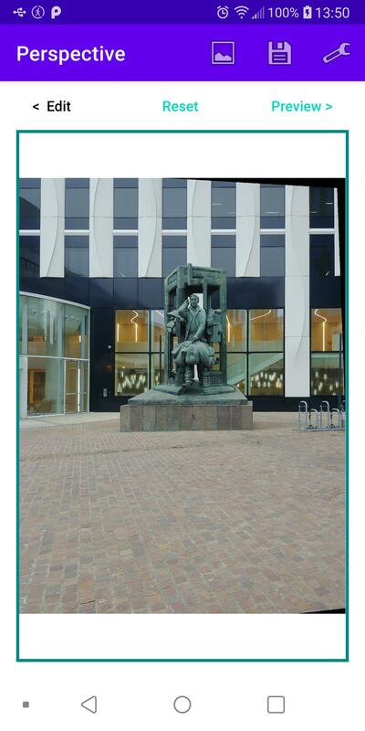

# Perspective #

Android application to fix perspective in photos.
Internaly it uses OpenCL to load / save and warp photos.

* [Screenshots](#screenshots)
* [To Do](#to-do)

## Screenshots ##

Initial perspective | Warped perspective | Warped preview
--- | --- | ---
 |  | 

## To Do ##

* Add auto detect warping (can be tunned manually)
* Switch between view / preview: try to use fragments for a nicer transition
* Allow portrait mode: in this mode show side by side edit and preview
* Auto generate preview (if there is no edit for 1 second for example)
